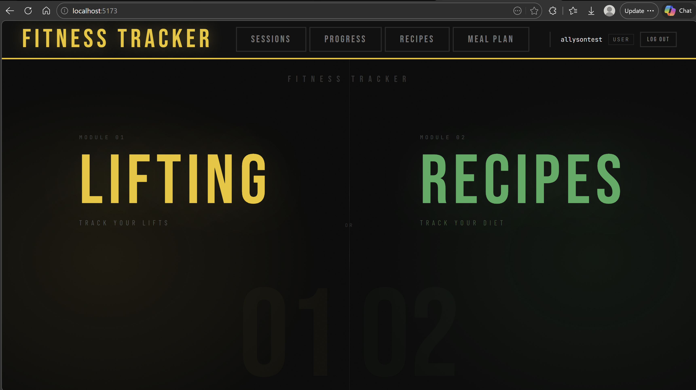
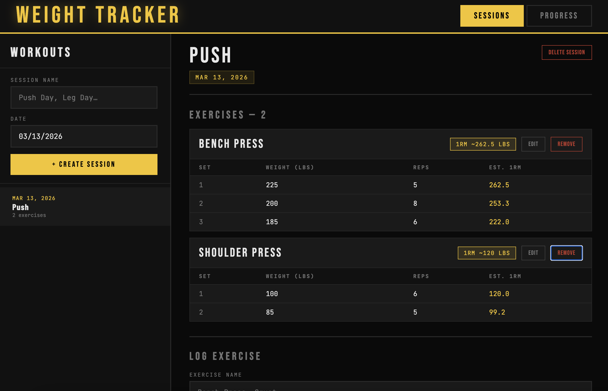
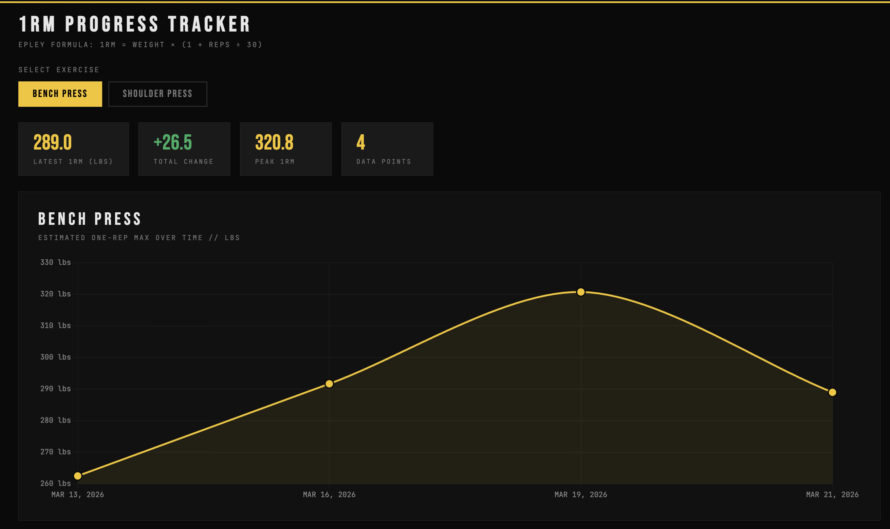
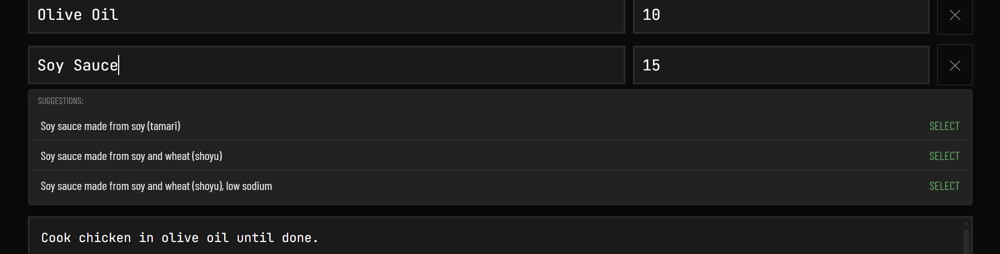
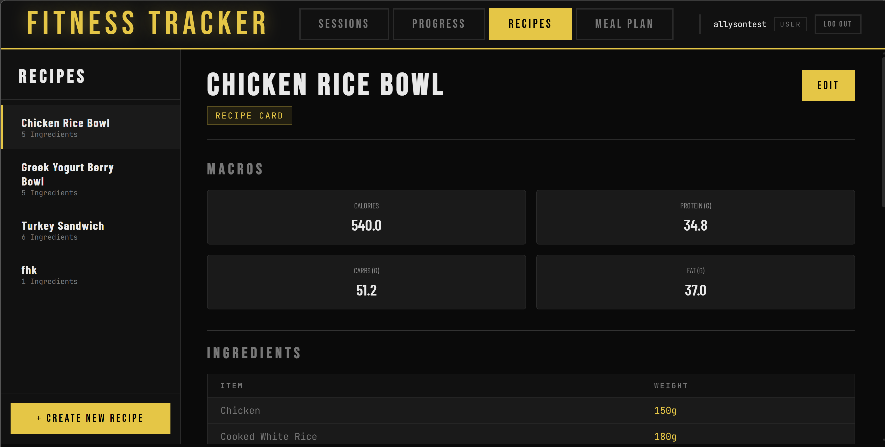
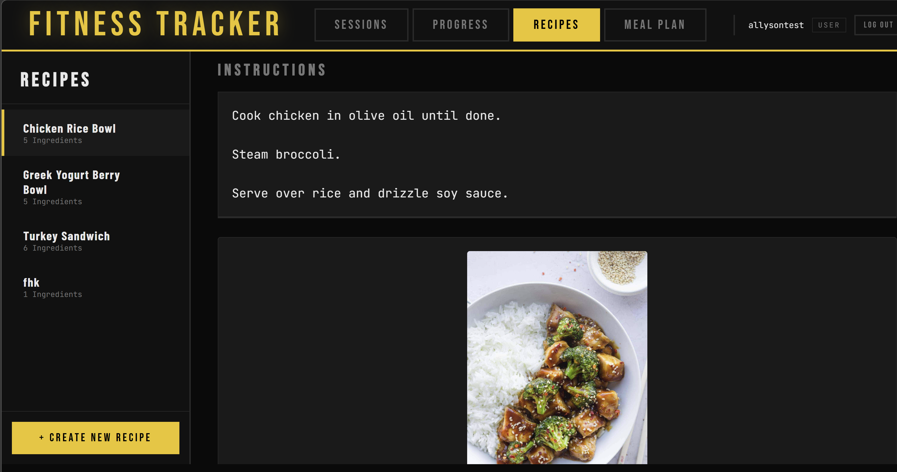
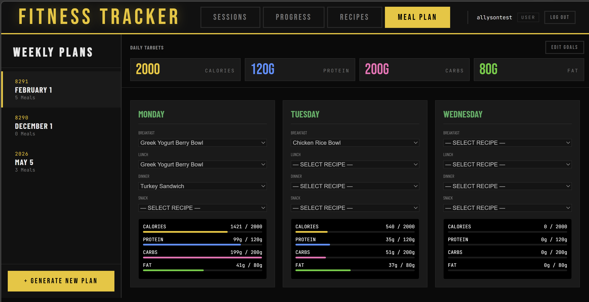
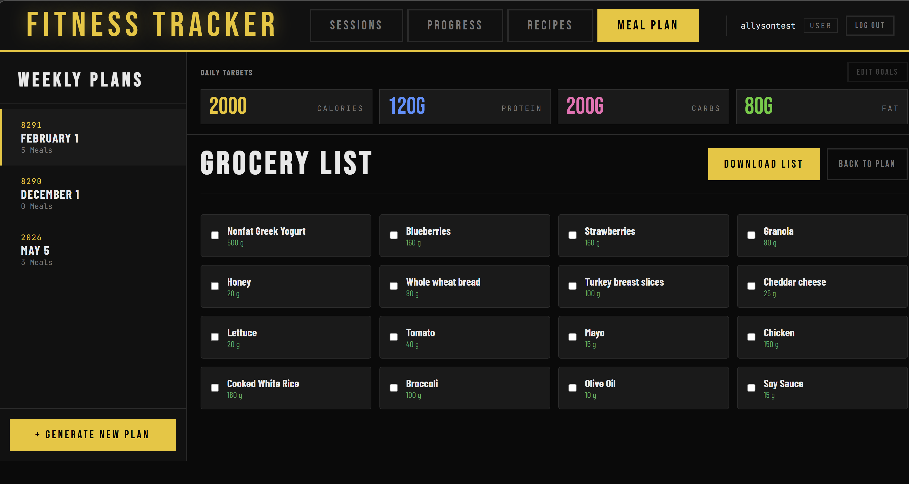

# Fitness Tracker Application

A comprehensive full-stack fitness, nutrition, and meal-planning application designed to help users monitor their health journey through data-driven insights and organized preparation.

---

## Project Preview

> **Dashboard Overview**  
> 

---

## Getting Started

### Prerequisites
- **Node.js** (v16 or higher)
- **npm** or **yarn**
- **Database**: [Specify your DB, e.g., PostgreSQL/MongoDB]

### Installation & Setup

1. **Clone the Repository**
   ```bash
   git clone <repository-url>
   cd cs3990-final-fitness-tracker
   ```

2. **Backend Configuration**
   - Navigate to the server directory: `cd backend`
   - Install dependencies: `npm install`
   - Create a `.env` file and configure:
     ```env
     DATABASE_URL=your_db_connection_string
     API_KEY=your_macro_api_key
     ```
   - Start the server: `npm start`

3. **Frontend Configuration**
   - Navigate to the client directory: `cd frontend`
   - Install dependencies: `npm install`
   - Start the development server: `npm run dev`

---

## Project Features & User Capabilities

Our application provides a holistic approach to health management, allowing users to handle everything from workout intensity to weekly food preparation.

### 1. Fitness & Activity Tracking (CRUD)
Maintain a complete history of your physical activity with full CRUD capabilities:
- **Log Workouts**: Create new entries with exercise types, sets, reps, and weights.
- **View History**: Read and review your past workout performance.
- **Edit Logs**: Update entries to correct mistakes or adjust data.
- **Remove Entries**: Delete logs that are no longer relevant to your history.

> **Excersise Log**
> 

### 2. Progress Visualization
The application utilizes **Chart.js** to transform raw data into visual insights. Users can track their weight trends, strength increases, and caloric consistency over time.

> **Progress Chart**
> 

### 3. Nutrition & Macro API Integration
The app features an integrated **Macro API Puller**. Users can search for specific food items, and the application fetches real-time nutritional data (Calories, Protein, Carbs, and Fats) from a verified external database to ensure accurate logging.

> **Macro API Searching**
> 

### 4. Recipe & Meal Management
- **Save Recipes**: Create a digital cookbook of your favorite healthy meals.
- **Create Meal Plans**: Organize your week by assigning recipes to specific days.
- **Recipe Image Upload**: (File Upload) Users can personalize their saved recipes by uploading custom images of their prepared meals.

> **Recipe Page**
> 

> **Image Uploaded to Recipe**
> 

> **Meal Plan Page**
> 

### 5. Grocery List Generation
- **Automatic Generation**: The app parses your weekly meal plan to identify all necessary ingredients.
- **Export List**: (File Download) Users can download their generated grocery list as a portable file (e.g., PDF or Text) for easy use while shopping.

> **Generated Grocery List**
> 

---

## Backend Architecture

### Database
Our database is designed to handle complex relationships between users, their scheduled workouts, saved recipes, and meal plans.

### System Logging & Monitoring
To ensure reliability and ease of debugging, the backend implements a centralized logging strategy:
- **Traffic Monitoring**: Logs all incoming HTTP requests and response codes.
- **Error Tracking**: Detailed error stacks are logged for system failures.
- **Audit Trail**: Tracking of critical data changes (e.g., user registration, file deletions).

### Security
- Password hashing using **bcrypt**.
- Authentication via **JWT (JSON Web Tokens)**.

---

## Testing & Quality Assurance

Stability is maintained through a multi-tiered testing suite:
- **Unit Tests**: Verifying individual logic components (e.g., macro calculations).
- **Integration Tests**: Ensuring seamless communication between the React frontend and the Node.js API.
- **End-to-End (E2E) Tests**: Simulating complete user journeys, such as "Register -> Create Meal Plan -> Download Grocery List."
